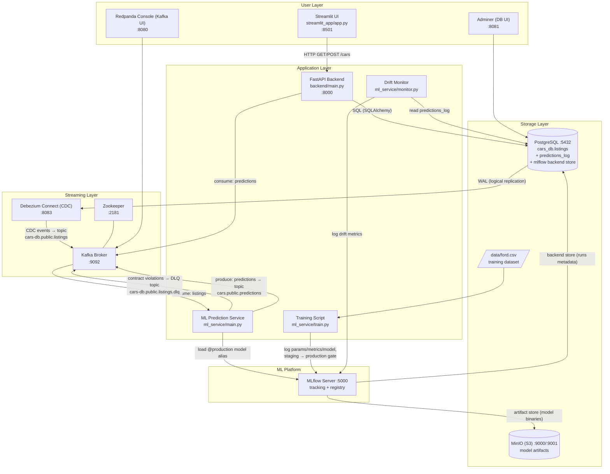
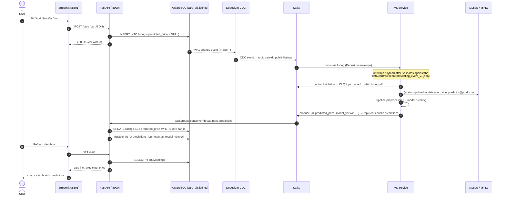
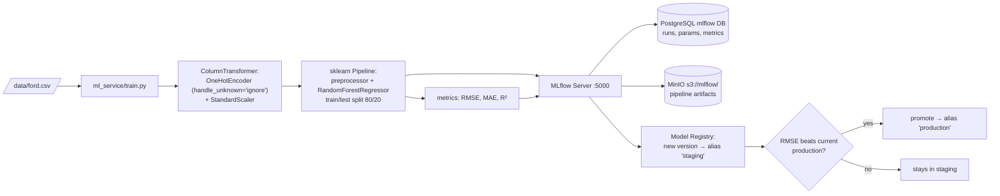

# Car Price Predictor — Workflow & Data Flow

This document describes how the components in this repository interact, both at
runtime (the prediction loop) and during model training.

## 1. Component Overview

## 2. Runtime Prediction Loop (sequence)

This is the main data flow: a car added by a user travels through the system
and comes back enriched with a `predicted_price`.

## 3. Training Pipeline (offline)

## Key Details

- **One path into the listings topic**: Debezium streams every committed insert
  from the Postgres WAL into `cars-db.public.listings`
  (`debezium-connector-config.json`). The backend does **not** publish to Kafka
  itself, so each car produces exactly one event — and changes made outside the
  API (e.g. SQL in Adminer) are captured too.
- **Data contract + dead letter topic**: the ML service validates every event
  against `contracts/listing_event_v1.json` (JSON Schema, versioned in git —
  the same contract the backend enforces at the API edge via Pydantic).
  Violations go to `cars-db.public.listings.dlq` with the error attached;
  nothing is silently dropped.
- **Topics**:
  - `cars-db.public.listings` — new/changed car listings (input to ML service)
  - `cars-db.public.listings.dlq` — contract-violating events (dead letter)
  - `cars.public.predictions` — prediction results (input to backend consumer)
- **Train/serve parity**: preprocessing lives inside a single sklearn
  `Pipeline` (`ColumnTransformer` + `RandomForestRegressor`) that is logged to
  MLflow as one artifact — there is no separate encoder/scaler to keep in sync.
  `OneHotEncoder(handle_unknown='ignore')` also makes the service robust to
  car models never seen in training.
- **Model lifecycle**: `train.py` tags each new version `staging` and promotes
  it to the `production` alias only if its RMSE beats the current production
  model. The ML service loads `models:/car_price_predictor@production` and
  stamps every prediction with the `model_version` it used (lineage).
- **Monitoring**: every prediction is also written to the `predictions_log`
  table by the backend consumer. `ml_service/monitor.py` compares its feature
  distributions against `data/ford.csv` using PSI (threshold 0.2) and logs the
  report to the `drift-monitoring` MLflow experiment.
- **Backend consumer** (`backend/main.py`): a daemon thread started at FastAPI
  startup that listens on `cars.public.predictions` and writes
  `predicted_price` back into Postgres, closing the loop.
- **Streamlit** only talks to the FastAPI REST API; it never touches Kafka,
  Postgres, or MLflow directly.
- **Admin/observability UIs**: Adminer (:8081) for Postgres, Redpanda Console
  (:8080) for Kafka/Connect, MLflow UI (:5000), MinIO console (:9001).
- **Seeding data**: `add_cars.sh` POSTs a batch of sample cars to
  `POST /cars`, each of which flows through the loop above.
