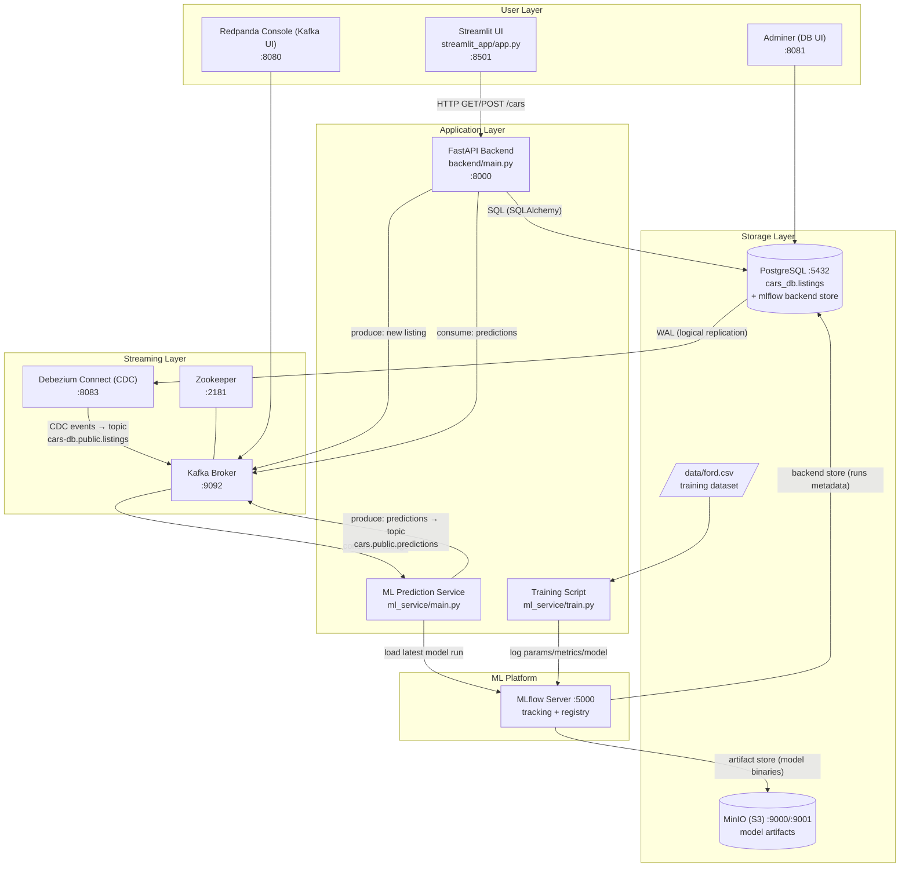
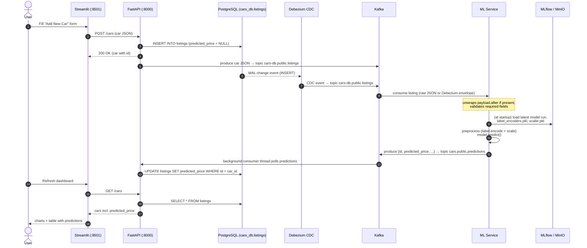
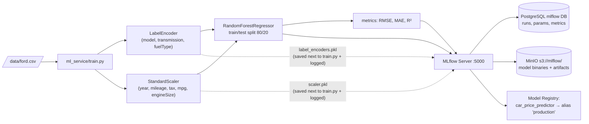

# Car Price Predictor — Workflow & Data Flow

This document describes how the components in this repository interact, both at
runtime (the prediction loop) and during model training.

## 1. Component Overview

## 2. Runtime Prediction Loop (sequence)

This is the main data flow: a car added by a user travels through the system
and comes back enriched with a `predicted_price`.

## 3. Training Pipeline (offline)

## Key Details

- **Two paths into the listings topic**: the backend publishes directly to
  `cars-db.public.listings` after an insert (`backend/main.py:180`), and
  Debezium independently streams the same insert from the Postgres WAL into the
  same topic (`debezium-connector-config.json`). The ML service tolerates both
  raw JSON and the Debezium envelope (`ml_service/main.py:151-154`).
- **Topics**:
  - `cars-db.public.listings` — new/changed car listings (input to ML service)
  - `cars.public.predictions` — prediction results (input to backend consumer)
- **ML service startup** (`ml_service/main.py`): loads `label_encoders.pkl` and
  `scaler.pkl` from disk, then pulls the most recent run's model from MLflow
  (`runs:/{run_id}/model`), whose artifacts live in MinIO.
- **Backend consumer** (`backend/main.py:124-161`): a daemon thread started at
  FastAPI startup that listens on `cars.public.predictions` and writes
  `predicted_price` back into Postgres, closing the loop.
- **Streamlit** only talks to the FastAPI REST API; it never touches Kafka,
  Postgres, or MLflow directly.
- **Admin/observability UIs**: Adminer (:8081) for Postgres, Redpanda Console
  (:8080) for Kafka/Connect, MLflow UI (:5000), MinIO console (:9001).
- **Seeding data**: `add_cars.sh` POSTs a batch of sample cars to
  `POST /cars`, each of which flows through the loop above.
